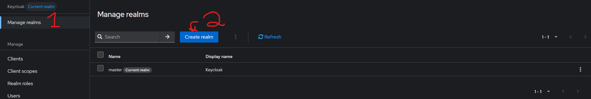
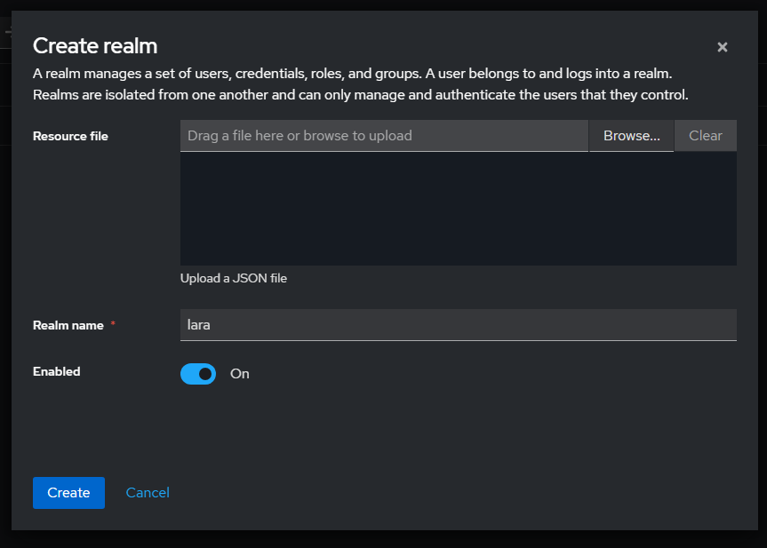
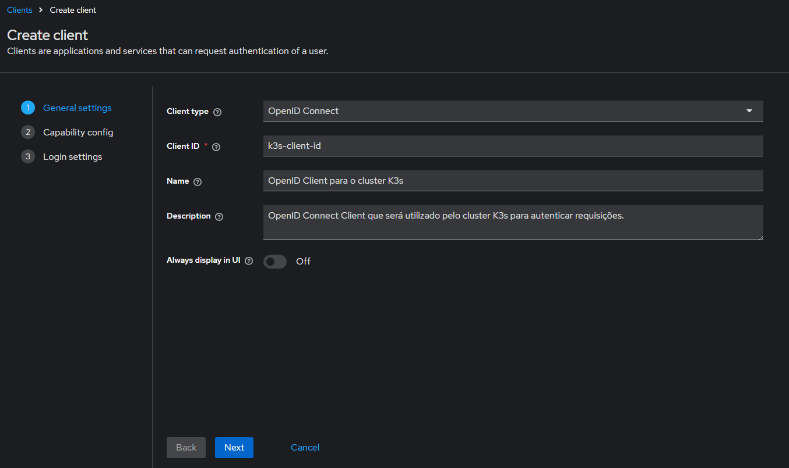
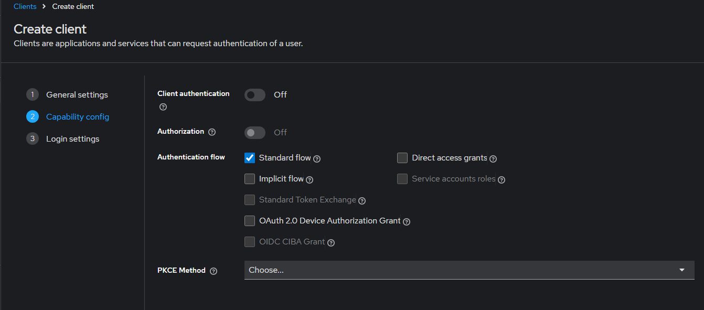
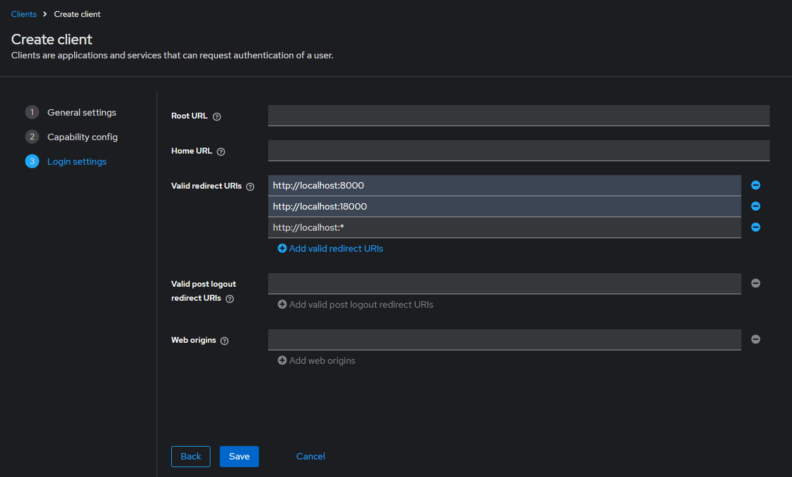
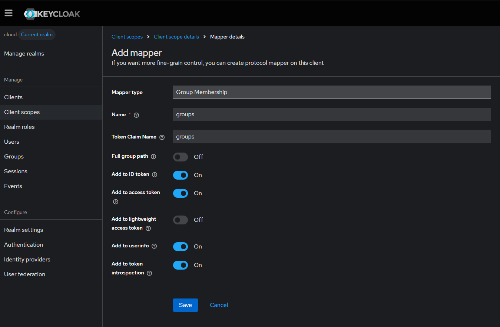
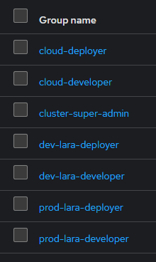

# LARA Cloud IAC

Este repositório conta com os códigos para a criação de um cluster Kubernetes usando a distribuição K3s, com autenticação e autorização através da ferramenta Keycloak. Os comandos aqui listados são executados diretamente no servidor e em alguns casos, como o do kubectl, pode requerer a execução como root.

Além disso, está documentação busca listar os passos que precisam ser realizados para a criação e configuração de um cluster de um único nó. Os tópicos desta documentação

- [LARA Cloud IAC](#lara-cloud-iac)
  - [Instalar k3s](#instalar-k3s)
  - [Criar certificados TLS](#criar-certificados-tls)
    - [Criar certificados com o Certbot](#criar-certificados-com-o-certbot)
    - [Criar os segredos para utilizar o certificado no Gateway do K3s](#criar-os-segredos-para-utilizar-o-certificado-no-gateway-do-k3s)
    - [Renovar certificados](#renovar-certificados)
  - [Expor API do K3s](#expor-api-do-k3s)
  - [Deploy e configuração do Keycloak como ferramenta OIDC](#deploy-e-configuração-do-keycloak-como-ferramenta-oidc)
    - [Configurar Keycloak](#configurar-keycloak)
    - [Configurar OIDC no K3s](#configurar-oidc-no-k3s)
    - [Configurar roles, grupos e o Keycloak para enviar os grupos para o Kubernetes](#configurar-roles-grupos-e-o-keycloak-para-enviar-os-grupos-para-o-kubernetes)
    - [Configurar kubectl no WSL para autenticar com o cluster K3s](#configurar-kubectl-no-wsl-para-autenticar-com-o-cluster-k3s)
  - [Ativar gateway](#ativar-gateway)
    - [Deploy dos Gateways e das rotas para o ambiente de cloud](#deploy-dos-gateways-e-das-rotas-para-o-ambiente-de-cloud)

## Instalar k3s

Para instalar o k3s execute o comando abaixo. É possível realizar o deploy com maiores customizações, mas a arquitetura atual utiliza o que vem por padrão.

```shell
curl -sfL https://get.k3s.io | sh -
```

> [!NOTE]
> O comando acima é para o deploy em um único servidor, com agent e server no mesmo nó. Para o deploy de novos nós, em caso de aumento de máquinas no cluster, acesse a documentação do k3s: https://docs.k3s.io/

## Criar certificados TLS

Um ponto muito importante envolvendo segurança é o uso de certificados TLS e o protocolo HTTPS. Para criar esses certificados for utilizado a ferramenta [Certbot](https://certbot.eff.org/), que permite a criação de certificados válidos TLS gratuitamente.

Neste projeto foram utilizados e criados 4 certificados: para o API do cluster e para os gateways dos ambientes de cloud, desenvolvimento e produção.

> [!NOTE]
> É possível utilizar um certificado ao invés de quatro, o uso de vários certificados foi feito visando maior segurança.

### Criar certificados com o Certbot

Para criar os certificados é necessário executar os comandos abaixo e seguir o passo do desafio (precisa de acesso ao dns):

1. Criar certificado para o cluster
    ```shell
    sudo certbot certonly --manual --cert-name cluster-cert --preferred-challenges=dns -d cluster.bonfimalan.com.br
    ```
2. Criar certificado para o ambiente de cloud
    ```shell
    sudo certbot certonly  --cert-name cloud-cert --manual --preferred-challenges=dns -d '*.cloud.bonfimalan.com.br' -d 'cloud.bonfimalan.com.br'
    ```
3. Criar certificado para o ambiente de produção
    ```shell
    sudo certbot certonly  --cert-name lara-cert --manual --preferred-challenges=dns -d '*.lara.bonfimalan.com.br' -d 'lara.bonfimalan.com.br'
    ```
4. Criar certificado para o ambiente de desenvolvimento
    ```shell
    sudo certbot certonly  --cert-name lara-dev-cert --manual --preferred-challenges=dns -d '*.lara-dev.bonfimalan.com.br' -d 'lara-dev.bonfimalan.com.br'
    ```

> [!NOTE]
> A parte "bonfimalan.com.br" é o domínio raiz e o que vem antes do "." é subdomínio, os certificados são para o subdomínio principal e os seus subdomínios. Caso seja optado pela criação de um único certificado, basta colocar todos os domínios neste certificado único.

### Criar os segredos para utilizar o certificado no Gateway do K3s

Para que os certificados sejam utilizados nos Gateways do Kubernetes é necessário criar um _secret_ TLS. Para isso basta executar os comandos abaixo:

1. Criar o segredo tls para o ambiente de cloud
    ```shell
    sudo kubectl create secret tls cloud-tls \
    -n cloud \
    --cert=/etc/letsencrypt/live/cloud-cert/fullchain.pem \
    --key=/etc/letsencrypt/live/cloud-cert/privkey.pem
    ```
2. Criar o segredo tls para o ambiente de produção
    ```shell
    sudo kubectl create secret tls lara-prod-tls \
    -n lara-production \
    --cert=/etc/letsencrypt/live/lara-cert/fullchain.pem \
    --key=/etc/letsencrypt/live/lara-cert/privkey.pem
    ```
3. Criar o segredo tls para o ambiente de desenvolvimento
    ```shell
    sudo kubectl create secret tls lara-dev-tls \
    -n lara-development \
    --cert=/etc/letsencrypt/live/lara-dev-cert/fullchain.pem \
    --key=/etc/letsencrypt/live/lara-dev-cert/privkey.pem
    ```

> [!NOTE]
> `cloud-cert`, `lara-dev-cert` e `lara-cert` são os nomes dos certificados criados no tópico anterior na opção `--cert-name`

### Renovar certificados

TODO

## Expor API do K3s

1. Instalar Nginx:

    ```shell
    sudo apt install nginx
    ```

2. Criar um arquivo para a configuração do sever no caminho `/etc/nginx/sites-available/k3s-api.conf`  e adicionar o conteúdo abaixo, a porta é definida no listen e deve ser uma que esteja livre no servidor: 

    ```conf
    server {
        listen 7443 ssl;
        server_name cluster.bonfimalan.com.br;

        # Your Let’s Encrypt certificate
        ssl_certificate     /etc/letsencrypt/live/cluster-cert/fullchain.pem;
        ssl_certificate_key /etc/letsencrypt/live/cluster-cert/privkey.pem;

        # Security for API server (optional)
        ssl_protocols TLSv1.2 TLSv1.3;

        location / {
            proxy_pass https://127.0.0.1:6443;
            proxy_ssl_verify off; # Important! The internal API uses self-signed cert
            proxy_ssl_server_name on;
            
            proxy_set_header Host $host;
            proxy_set_header X-Forwarded-Proto https;
            proxy_set_header X-Forwarded-For $remote_addr;
        }
    }
    ```
> [!note]
> A API será exposta na porta `7443` que deve ser configurada para aceitar requisições TCP no firewall.

3. Ativar o site com a seguinte sequência de comandos:

    ```shell
    sudo ln -s /etc/nginx/sites-available/k3s-api.conf /etc/nginx/sites-enabled/
    sudo nginx -t
    sudo systemctl reload nginx
    ```

## Deploy e configuração do Keycloak como ferramenta OIDC

O Keycloak é uma peça muito importante da infraestrutura, para realizar o seu deploy siga os passos listados no arquivo _readme_: [REAME.md](keycloak/README.md).

### Configurar Keycloak

Para configurar o Keycloak para ser usado para autenticar e autorizar requisições do cluster Kubernetes é necessário criar e configurar um Realm no Keycloak, seguindo os passos nas imagens abaixo:




Crie o Client para o k3s na aba Client → Create client seguindo os passos nas imagens abaixo:





### Configurar OIDC no K3s

Para configurar o K3s para utilizar o Keycloak como autenticador e autorizador de requisições basta seguir os passos abaixo.

1. Editar ou criar, caso não exista, o arquivo de configuração `/etc/rancher/k3s/config.yaml` com os valores abaixo:
    ```yaml
    kube-apiserver-arg:
    - oidc-issuer-url=https://{domínio do keycloak}/realms/{nome do realm}
    - oidc-client-id={cliente para o k3s}
    - oidc-username-claim=preferred_username
    - oidc-groups-claim=groups
    ```

    >[!NOTE]
    > Os valores presentes entre {} devem ser editados para os valores correspondentes a implementação.
2. Reinicie o serviço do K3s:
    ```shell
    sudo systemctl restart k3s
    ```

### Configurar roles, grupos e o Keycloak para enviar os grupos para o Kubernetes

Para que o K3s faça a autorização utilizando o Keycloak é necessário criar grupos na aba grupo do Keycloak e configurar para que os grupos sejam enviados para o K3s. Para configurar é no caminho: Client → {Cliente do K3s} → Client Scopes → roles → Mappers → Add Mapper. Com as seguintes configurações:

- Type: **Group Membership**
- Name: `groups`
- Token Claim Name: `groups`
- Full Group Path: **OFF**



Depois realize o deploy dos manifestos com as roles:

```
kubectl apply -f roles/cloud-roles.yaml -f roles/cluster-roles.yaml -f roles/dev-roles.yaml -f roles/prod-roles.yaml
```

Depois é necessário criar os grupos no Keycloak com os nomes da imagem abaixo. Os nomes são os mesmos presentes no campo `subjects.name` para os role binding quando o `subjects.kind` tem o valor `Group`.



### Configurar kubectl no WSL para autenticar com o cluster K3s

Precisa instalar o plugin `kubectl-oidc_login` que os passos não estão listados aqui.

Realizar o login
```shell
kubectl oidc-login setup \
  --oidc-issuer-url https://{domínio do keycloak}/realms/{realm do projeto} \
  --oidc-client-id {cliente do k3s}
```
Para realizar o “logout” do kubectl (não há um comando de _logout_):

```shell
rm -rf ~/.kube/cache/oidc-login
```
## Ativar gateway

Por padrão o K3s não vem com o Gateway API ativado, pelo menos na versão atual. Por isso, é necessário ativar seguindo os passos abaixo:

1. Instalar o CRD do Gateway API com o seguinte comando (caso ainda não esteja instalado, verificar a versão no repositório do github https://github.com/kubernetes-sigs/gateway-api):
    ```shell
    sudo kubectl apply -f https://github.com/kubernetes-sigs/gateway-api/releases/download/v1.4.0/standard-install.yaml
    ```
2. Criar o seguinte arquivo yaml no diretório `/var/lib/rancher/k3s/server/manifests/traefik-config.yaml`
    ```yaml
    apiVersion: helm.cattle.io/v1
    kind: HelmChartConfig
    metadata:
    name: traefik
    namespace: kube-system
    spec:
    valuesContent: |
        providers:
        kubernetesGateway:
            enabled: true

        gateway:
        enabled: true
    ```
3. Reiniciar o k3s para aplicar as alterações:
    ```shell
    sudo systemctl status k3s
    ```
4. Verifique se o gateway está ativo:
    ```shell
    sudo kubectl get gatewayclass
    ```

### Deploy dos Gateways e das rotas para o ambiente de cloud

Os passos para o deploy dos Gateways e das rotas HTTP para o ambiente de cloud estão listados no arquivo [REAME.md](gateway/README.md).
